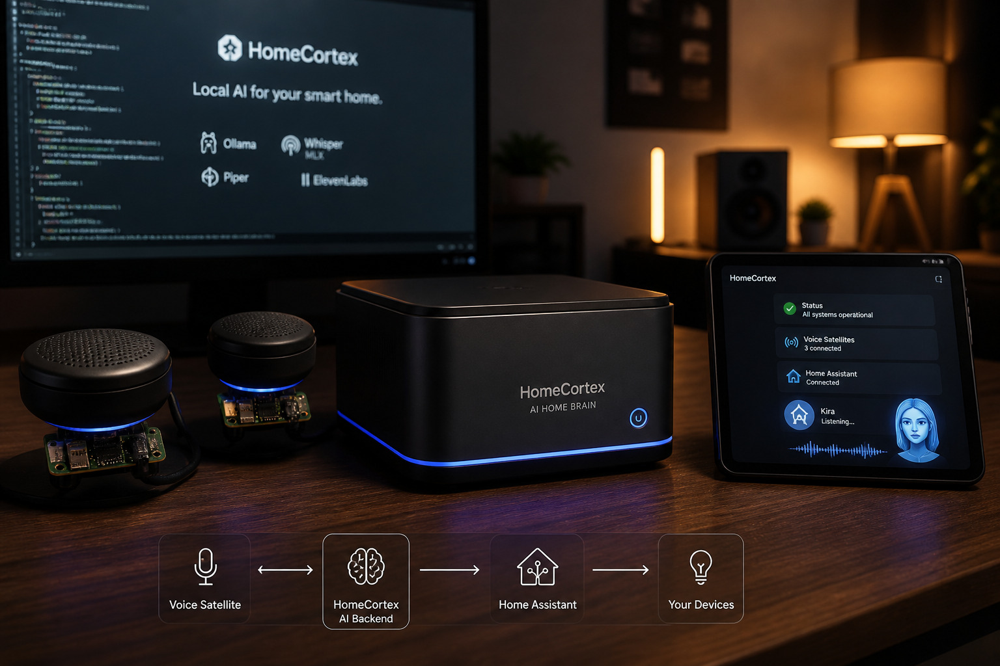
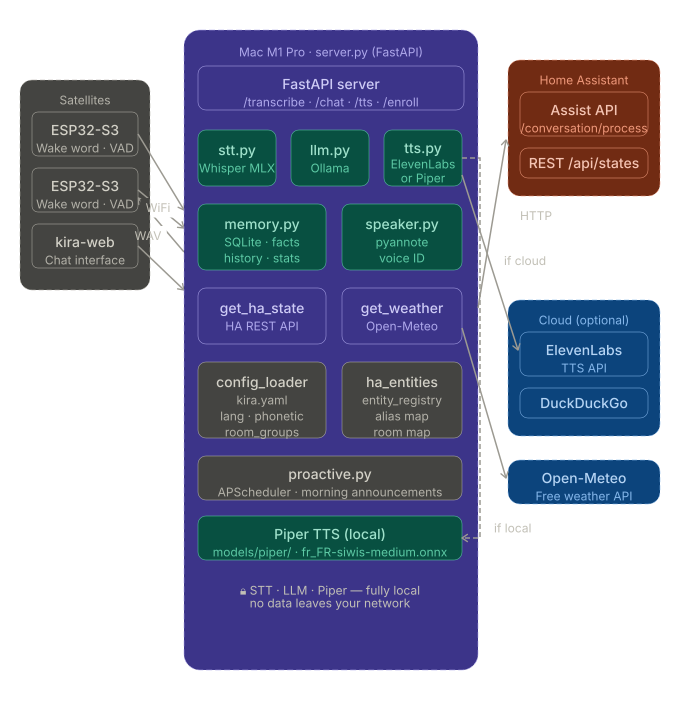
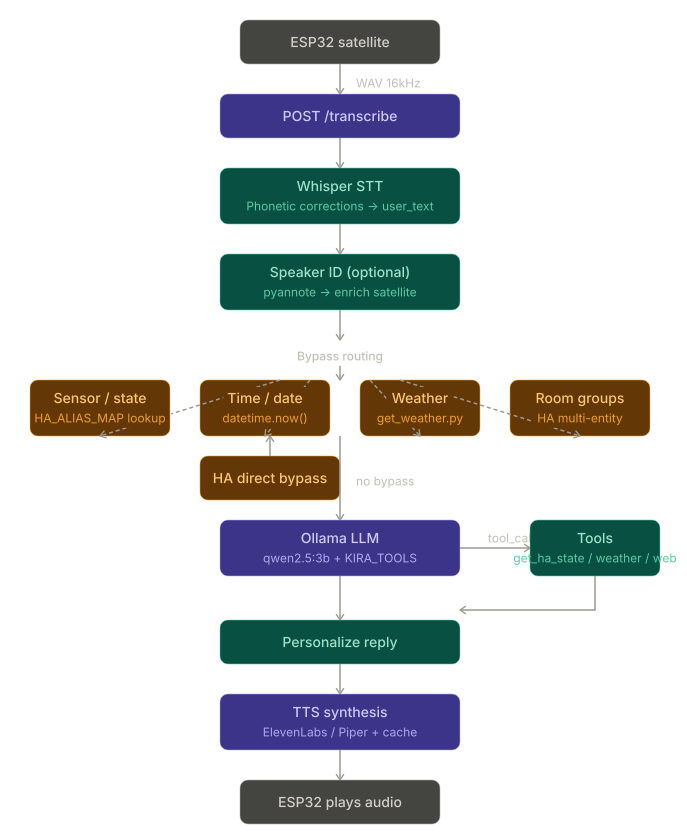

[](https://python.org)
[](https://fastapi.tiangolo.com)
[](https://home-assistant.io)
[](LICENSE)
[](#language)

# 🎙️ HomeCortex — Local Voice AI for Smart Home


> **A fully local, privacy-first voice assistant backend for Home Assistant.**  
> No cloud. No subscriptions. No data leaving your network.


---

## ✨ What is HomeCortex?

HomeCortex is an open-source, self-hosted AI backend for smart homes. It connects ESP32-S3 voice satellites to Home Assistant, processes natural language locally using LLMs, and generates natural voice responses — all without sending a single byte to the cloud.

Kira is the default voice assistant powered by HomeCortex.

Built around Whisper (STT), Ollama (LLM), and Piper or ElevenLabs (TTS), HomeCortex runs on Apple Silicon (Mac M1/M2) and ARM-based edge systems, communicating with distributed ESP32-S3 voice satellites over WiFi.

The platform is designed with a privacy-first and edge-native architecture, enabling low-latency voice interactions, local AI inference, and fully self-hosted automation workflows.

Although primarily designed for French language interactions, the platform also supports English and can be extended to additional languages.

HomeCortex explores the convergence of edge computing, embedded systems, local LLM inference, and real-time voice-driven AI applications for next-generation smart environments.


---

## 🎯 Design Goals

- Privacy-first local AI
- Low-latency voice interaction
- Modular backend architecture
- Edge-compatible satellite devices
- Apple Silicon optimized inference
- Seamless Home Assistant integration

---

## 🏗️ Architecture

<p align="center">

  

</p>


---

## 🧠 Memory Architecture

HomeCortex implements a lightweight persistent memory system built on SQLite (`config/kira_memory.db`).

The architecture combines semantic memory, episodic conversation history, adaptive interaction patterns, speaker profiles, and TTS caching within a unified local database.

All memory layers persist across server restarts while remaining fully local and privacy-preserving.

---

### Semantic Memory — Facts

Semantic memory stores persistent facts about the household, users, devices, and preferences.

Facts can be:

- explicitly provided by users,
- extracted automatically from conversations,
- inferred from repeated interaction patterns.

Examples:

```text
"Emmanuel prefers 19°C at night"
"The guest bedroom light is controlled by the switch near the door"
```

Stored facts are automatically injected into the LLM system prompt under:

```text
WHAT YOU KNOW ABOUT THE HOME
```

This allows HomeCortex to maintain long-term contextual awareness without requiring users to repeat information across sessions.

#### Memory API

```bash
# View stored facts
curl -H "X-Token: YOUR_TOKEN" \
http://localhost:8000/memory/facts

# Delete a fact by ID
curl -X DELETE -H "X-Token: YOUR_TOKEN" \
http://localhost:8000/memory/facts/3
```

---

### Episodic Memory — Conversation History

The last *N* exchanges per satellite are stored in SQLite
(default: `20`, configurable through `config/kira.yaml → memory.max_history`).

During each LLM inference call, recent conversation history is prepended to the messages context window, enabling conversational continuity even after server restarts.

Each satellite maintains an independent conversation history:

```text
Bedroom conversations remain isolated from kitchen interactions.
```

This prevents contextual leakage across rooms and preserves localized conversational context.

---

### Adaptive Context — Learned Habits

HomeCortex continuously tracks recurrent interaction patterns through the `query_stats` table.

Once a pattern exceeds a configurable repetition threshold
(default: `10` occurrences), it is automatically promoted into the runtime system context as a learned habit.

Example:

```text
LEARNED HABITS:
- Favorite weather city: Geneva (47 requests)
- Frequent action: living room light (23 requests)
```

This adaptive layer enables HomeCortex to:

- reduce clarification requests,
- improve intent prediction,
- infer preferred defaults automatically,
- provide more natural long-term interactions.

---

### Unified SQLite Schema

```sql
facts
(
    id,
    content,
    source,
    created,
    updated
)

history
(
    id,
    satellite_id,
    role,
    content,
    created
)

query_stats
(
    id,
    intent,
    canonical,
    count,
    last_seen,
    extra
)

speaker_profiles
(
    id,
    name,
    embedding,
    n_samples,
    created,
    updated
)

tts_cache
(
    hash,
    text,
    wav,
    backend,
    hits,
    created,
    last_hit
)
```

By default, `speaker_profiles` and `tts_cache` share the same SQLite database file.

The storage layout can be separated through:

```text
config/kira.yaml → memory.db
config/kira.yaml → tts.cache_db
```

---

## 🛰️ ESP32-S3 Satellites

HomeCortex communicates with distributed ESP32-S3 voice satellites over WiFi.

The satellite firmware is developed separately in:

- [ESP-myhome-EchoEar](https://github.com/colussim/ESP-myhome-EchoEar?utm_source=chatgpt.com)

Current hardware platforms include:

### ESP-VoCat v1.2 (Espressif)

The current reference satellite is based on the official ESP-VoCat v1.2 development board by Espressif.

Features:

- ESP32-S3 dual-core MCU
- Integrated audio codec
- I2S microphone + speaker pipeline
- Wake word detection
- Voice Activity Detection (VAD)
- Low-latency WiFi streaming

This platform is used for rapid prototyping and real-world home deployment.

---

### DIY Satellite Platform (in development)

A fully custom satellite hardware platform is currently under development.

Goals include:

- smaller form factor,
- improved acoustic design,
- optimized microphone array,
- lower idle power consumption,
- easier room integration,
- fully open hardware design.

The long-term objective is to create lightweight edge-native voice nodes optimized for always-on distributed AI interaction.

---

## ✨ Features

- 🎤 **Low-latency local speech recognition** using Whisper MLX optimized for Apple Silicon
- 🧠 **Fully local LLM inference** powered by Ollama (`qwen2.5:3b` recommended)
- 🔊 **Natural speech synthesis** with Piper (local) or ElevenLabs (cloud)
- 🏠 **Home Assistant integration** for contextual device control and state retrieval
- 🎙️ **Speaker identification** using pyannote.audio for personalized interactions
- 💬 **Web chat interface** built with Go (`kira-web`)
- 📅 **Proactive assistant capabilities** including scheduled reminders and weather briefings
- 🌍 **Multi-language support** with runtime FR/EN configuration

---

## 🧠 Hardware Strategy

HomeCortex follows a two-phase deployment strategy designed to balance rapid development, low-latency inference,and future edge-AI portability.

### Phase 1 — Apple Silicon Development Platform (current)

Apple Silicon systems (Mac Mini / Mac Studio M-series) provide an excellent platform for real-time local AI workloads:

| Capability | Engineering Benefit |
|---|---|
| **Neural Engine (16+ TOPS)** | Accelerated Whisper MLX inference (~0.5s STT) |
| **Unified Memory Architecture** | Simultaneous STT + LLM + backend execution |
| **Metal GPU Acceleration** | Native Ollama acceleration |
| **Low Power Consumption** | Suitable for 24/7 always-on deployment |
| **macOS Stability** | Reliable long-running home server environment |


### Phase 2 — Edge AI Migration (Arduino VENTUNO Q)

The backend architecture is designed to remain hardware-agnostic,
allowing migration from Apple Silicon to embedded AI platforms
without major software refactoring.

```text
 Apple Silicon                          Edge AI Platform
───────────────────            ─────────────────────────────

 STT  : Whisper MLX     ───►   faster-whisper
 LLM  : Ollama          ───►   llama.cpp (GGUF)
 TTS  : Piper / EL      ───►   Coqui XTTS v2

 Runtime abstraction layer
 Environment-based backend selection

 Target:
 Qualcomm Dragonwing IQ8 (40 TOPS NPU)
 Arduino VENTUNO Q
```

This architecture enables experimentation across heterogeneous AI hardware targets while preserving a unified application layer.

---

## 🌍 Language Support

HomeCortex is primarily optimized for French interactions, including
Home Assistant entity aliases, wake phrases, and conversational prompts.

However, the overall architecture remains fully language-agnostic and can be adapted to other languages without modifying the backend logic.

### Supported Components

- **Whisper** provides multilingual speech recognition (99+ languages)
- **Ollama** enables multilingual LLM inference (Qwen2.5, Mistral, Llama 3.x)
- **Home Assistant aliases** can be defined in any language
- **Prompt behavior** is configurable through external prompt templates
- **TTS providers** can be swapped independently of the inference pipeline

### Speech Recognition Vocabulary Injection

To improve speech recognition accuracy in smart-home environments,
Whisper contextual hints (`WHISPER_HINT`) are dynamically generated at startup by aggregating multiple vocabulary sources:

```text
1. Base language vocabulary
   └─ config/lang/<lang>.yaml → whisper_hint_base

2. Home Assistant entity aliases
   └─ HA/core.entity_regsitry  → Home Assistant entity registry

3. Forced phonetic vocabulary
   └─ config/phonetic.yaml → force_vocabulary

This mechanism improves recognition accuracy for:

* Home Assistant entity names
* Custom room and device aliases
* Proper nouns and uncommon words
* Phonetically ambiguous terms
* Multilingual household environments

Adapting to Another Language

Minimal configuration changes are required:

1. Set the target language in:
   └─ config/kira.yaml 

2. Translate the assistant prompt templates
3. Update the base vocabulary and phonetic rules:
   └─ config/lang/<lang>.yaml
   └─ config/phonetic.yaml

4. Select an appropriate TTS voice (Replace ElevenLabs voice ID with your preferred voice)

The runtime architecture remains unchanged, enabling language adaptation entirely through configuration without requiring backend code modifications.

```

## 📂 Project Structure

```text
homecortex/
├── server.py                    # Main FastAPI server
├── prompt.txt                   # Kira personality system prompt
├── prompt_suffix_fr.txt         # French runtime context and rules
├── prompt_suffix_en.txt         # English runtime context and rules
│
├── backends/
│   ├── stt.py                   # Speech-to-Text (Whisper MLX / faster-whisper)
│   ├── llm.py                   # LLM inference (Ollama / llama.cpp)
│   ├── tts.py                   # Text-to-Speech (Piper / ElevenLabs / XTTS)
│   ├── memory.py                # SQLite conversational memory
│   └── speaker.py               # Speaker identification (pyannote.audio)
│
├── services/
│   ├── config_loader.py         # Centralized YAML configuration loader
│   ├── get_ha_state.py          # Home Assistant state retrieval
│   ├── get_weather.py           # Weather service (wttr.in)
│   ├── web_search.py            # DuckDuckGo web search
│   ├── ha_entities_loader.py    # Home Assistant entity alias loader
│   └── proactive.py             # Scheduled announcements (APScheduler)
│
├── config/
│   ├── kira.yaml                # ⚙️ Main configuration
│   ├── room_groups.yaml         # 💡 Room grouping definitions
│   ├── personas.yaml            # 👥 Household users and name variants
│   ├── phonetic.yaml            # 🔤 Whisper phonetic correction rules
│   ├── tools_config.json        # 🛠️ LLM tool configuration
│   ├── satellites.json          # 📡 Satellite tokens and room mapping
│   ├── lang/
│   │   ├── fr.yaml              # 🇫🇷 French keywords and responses
│   │   └── en.yaml              # 🇬🇧 English keywords and responses
│   └── kira_memory.db           # SQLite memory database (auto-generated)
│
├── models/
│   ├── piper/                   # Piper TTS voice models (.onnx + .json)
│   │   ├── fr_FR-siwis-medium.onnx        # French neural voice (recommended)
│   │   ├── fr_FR-siwis-medium.onnx.json   # Model config
│   │   └── en_US-lessac-medium.onnx       # English neural voice (optional)
│   │
│   └── xtts/                    # XTTS v2 voice cloning samples (optional)
│       └── speaker_kira.wav     # 20–30s reference recording for voice cloning
│
├── HA/
│   └── core.entity_registry     # Home Assistant entity registry cache
│
└── kira-web/                    # Web interface (Go)
    ├── kira-web-main.go
    ├── kira-web.json
    ├── templates/index.html
    ├── static/
    └── locales/
```


---

## 🔄 Request Pipeline

<p align="center">

  

</p>

---

## 🛠️ Installation

### Requirements

- macOS with Apple Silicon (M1/M2/M3/M4) or Linux x86_64
- Python 3.11+ (3.14 not supported for XTTS)
- [Ollama](https://ollama.ai) installed
- Home Assistant instance on local network
- ESP32-S3 satellite with ESP-SR framework

### Quick Start

```bash
# Clone
git clone https://github.com/colussim/HomeCortex.git
cd kira-voice

# Create virtual environment
python3.11 -m venv venv
source venv/bin/activate

# Install dependencies
pip install fastapi uvicorn python-dotenv pyyaml requests
pip install mlx-whisper                    # STT Apple Silicon
pip install piper-tts                      # TTS local
pip install pyannote.audio                 # Speaker ID (optionnel)
pip install apscheduler pytz               # Annonces proactives (optionnel)

# Configure
cp .env.example .env
# Edit .env with your HA URL, token, ElevenLabs key, etc.
# Adjust kira.yaml according to your setup
`config/kira.yaml` 

# Copy HA entity registry (for voice aliases)
mkdir -p HA
cp /path/to/homeassistant/.storage/core.entity_registry HA/

# Download LLM
ollama pull qwen2.5:3b

# Start
python server.py
```


### Configuration

HomeCortex follows a configuration-driven architecture.

All runtime behavior, language settings, backend selection, satellites,
personas, and automation rules are centralized in: `config/kira.yaml` 

The `.env` file is intentionally limited to secrets and private tokens only.

`.env` — Secrets Only

```bash
# API tokens and private credentials — NEVER COMMIT

KIRA_API_TOKEN="your_admin_token"

HA_TOKEN="your_home_assistant_token"
HA_URL="http://IP_HA:8123/api"
HA_URL_C="http://IP_HA:8123"

ELEVENLABS_API_KEY="sk_..."
# Optional — required only for ElevenLabs TTS

HF_TOKEN="hf_..."
# Optional — required only for pyannote speaker identification
```
---


## 🗣️ Voice models

The `models/` directory holds local TTS assets — no internet connection required at inference time.

### Piper (recommended)

Piper models are compact neural voices (~60 MB each) that run in under 1 second on Apple Silicon or a Raspberry Pi 5. Download the model for your language and place both the `.onnx` and its companion `.onnx.json` config file in `models/piper/`.

```bash
mkdir -p models/piper

# French voice
wget -P models/piper \
  https://huggingface.co/rhasspy/piper-voices/resolve/main/fr/fr_FR/siwis/medium/fr_FR-siwis-medium.onnx
wget -P models/piper \
  https://huggingface.co/rhasspy/piper-voices/resolve/main/fr/fr_FR/siwis/medium/fr_FR-siwis-medium.onnx.json

# English voice (optional)
wget -P models/piper \
  https://huggingface.co/rhasspy/piper-voices/resolve/main/en/en_US/lessac/medium/en_US-lessac-medium.onnx
wget -P models/piper \
  https://huggingface.co/rhasspy/piper-voices/resolve/main/en/en_US/lessac/medium/en_US-lessac-medium.onnx.json
```

Set the active model in `config/kira.yaml`:

```yaml
tts:
  piper_model: fr_FR-siwis-medium
  piper_models_dir: models/piper
```

### XTTS v2 — voice cloning (optional)

XTTS v2 clones a voice from a short audio sample and runs entirely locally. It produces the most natural-sounding output but adds ~1.5s latency compared to Piper.

**Requirements:**

```bash
pip install TTS
```

**Create a speaker sample** — record 20–30 seconds of clean speech in a quiet environment:

```bash
# Record via terminal (requires sox)
rec -r 22050 -c 1 models/xtts/speaker_kira.wav trim 0 25

# Or convert an existing file
ffmpeg -i your_recording.mp4 \
       -ar 22050 -ac 1 -sample_fmt s16 \
       models/xtts/speaker_kira.wav
```

Tips for a good sample: natural speech at a normal pace, no background noise, mix of questions and statements.

**Configure in `.env`:**

```bash
XTTS_SPEAKER_WAV=models/xtts/speaker_kira.wav
```

The XTTS v2 model (~1.8 GB) downloads automatically from Hugging Face on first startup.

### Fallback — espeak

If neither Piper nor XTTS is configured, Kira falls back to `espeak` — a lightweight rule-based synthesizer with no additional dependencies, suitable for testing.

```bash
# macOS
brew install espeak-ng

# Linux / Raspberry Pi
sudo apt install espeak-ng
```

### Comparison

| Backend | Latency | Quality | Size | Requires internet |
|---|---|---|---|---|
| Piper | ~0.8s | ★★★★☆ | ~60 MB/voice | No |
| XTTS v2 | ~1.5s | ★★★★★ | ~1.8 GB | No (download once) |
| ElevenLabs | ~0.4s | ★★★★★ | — | Yes |
| espeak | ~0.1s | ★★☆☆☆ | ~5 MB | No |


---

## 🚀 Running the server

### Option A — pm2 (recommended for macOS and Linux)

[pm2](https://pm2.keymetrics.io/) is a Node.js process manager that keeps the server running, restarts it on crash, and provides live log streaming. It is the recommended way to run Kira on both macOS and Linux.

**Install pm2:**

```bash
npm install -g pm2
```

**Start the server:**

```bash
cd /usr/local/whisper-server
source venv/bin/activate

pm2 start "venv/bin/uvicorn server:app --host 0.0.0.0 --port 8000" \
    --name whisper-server \
    --cwd /usr/local/whisper-server

pm2 save
```

**Auto-start on boot:**

```bash
# Generate and install the startup script
pm2 startup

# Run the command that pm2 prints, then save the process list
pm2 save
```

**Daily commands:**

```bash
pm2 status                        # show all running processes
pm2 logs whisper-server           # live log stream
pm2 logs whisper-server --lines 50 # last 50 lines
pm2 restart whisper-server        # restart after a config change
pm2 stop whisper-server           # stop without removing
pm2 delete whisper-server         # remove from pm2 process list
pm2 monit                         # interactive CPU/memory monitor
```

**What pm2 brings over a plain `nohup` or `screen`:**

- Automatic restart on crash or unhandled exception
- Log rotation with timestamps (`~/.pm2/logs/`)
- CPU and memory monitoring via `pm2 monit`
- Single command restart after `config/kira.yaml` changes
- Process persists across SSH session disconnects
- `pm2 startup` generates a system service automatically

---

### Option B — systemd (Linux only)

On a Raspberry Pi or any Linux server, you can run Kira as a native systemd service instead of pm2.

Create the service file:

```bash
sudo nano /etc/systemd/system/kira.service
```

```ini
[Unit]
Description=Kira Voice Assistant Server
After=network.target ollama.service

[Service]
Type=simple
User=pi
WorkingDirectory=/usr/local/whisper-server
ExecStart=/usr/local/whisper-server/venv/bin/uvicorn server:app --host 0.0.0.0 --port 8000
Restart=always
RestartSec=5
EnvironmentFile=/usr/local/whisper-server/.env
StandardOutput=journal
StandardError=journal

[Install]
WantedBy=multi-user.target
```

Enable and start:

```bash
sudo systemctl daemon-reload
sudo systemctl enable kira
sudo systemctl start kira
```

Daily commands:

```bash
sudo systemctl status kira        # show status
sudo journalctl -u kira -f        # live log stream
sudo journalctl -u kira -n 50     # last 50 lines
sudo systemctl restart kira       # restart after a config change
sudo systemctl stop kira          # stop the service
```

---

### pm2 vs systemd — quick comparison

| Feature | pm2 | systemd |
|---|---|---|
| Platform | macOS + Linux | Linux only |
| Auto-restart on crash | ✅ | ✅ |
| Boot auto-start | ✅ `pm2 startup` | ✅ `systemctl enable` |
| Live logs | ✅ `pm2 logs` | ✅ `journalctl -f` |
| CPU/memory monitor | ✅ `pm2 monit` | ❌ |
| Multiple processes | ✅ | ✅ |
| Setup complexity | Low | Medium |
| Requires Node.js | Yes | No |

> **Recommendation**: use pm2 on macOS (no systemd available) and on Linux developer machines for its interactive monitoring. Use systemd on production Linux servers for tighter OS integration and no Node.js dependency.

---

## 📍 API Endpoints

All endpoints require the `X-Token` header with a valid satellite or chat token configured in `config/satellites.json`.

### Voice processing

| Method | Endpoint | Description |
|---|---|---|
| `POST` | `/transcribe` | Receive WAV audio from a satellite, run STT + routing + TTS pipeline, return JSON with reply and WAV URL |
| `POST` | `/tts` | Synthesize text to WAV audio (used by satellites to fetch the audio response) |
| `POST` | `/chat` | Text-only interface — same routing pipeline as `/transcribe` without the STT step |

**Example `/transcribe` response:**
```json
{
  "status":       "success",
  "heard":        "quelle est la température extérieure ?",
  "room":         "salon",
  "reply":        "La température extérieure est de 12 degrés.",
  "ha_ack":       "no_action",
  "category":     "SPEECH",
  "expect_reply": false,
  "tts_available": true
}
```

### Speaker identification

| Method | Endpoint | Description |
|---|---|---|
| `POST` | `/enroll` | Register a voice profile — send a WAV file with `name` field |
| `GET` | `/speakers` | List all enrolled voice profiles |
| `DELETE` | `/speakers/{name}` | Delete a voice profile by name |

**Example enrollment:**
```bash
curl -X POST http://localhost:8000/enroll \
     -H "X-Token: YOUR_TOKEN" \
     -F "name=Emmanuel" \
     -F "audio=@/tmp/sample_30s.wav"
```

### Memory

| Method | Endpoint | Description |
|---|---|---|
| `GET` | `/memory/facts` | List all stored facts with their IDs |
| `DELETE` | `/memory/facts/{id}` | Delete a specific fact by ID |

### Proactive announcements

| Method | Endpoint | Description |
|---|---|---|
| `POST` | `/alert` | Push a text announcement to a specific satellite room |

**Example alert:**
```bash
curl -X POST http://localhost:8000/alert \
     -H "X-Token: YOUR_TOKEN" \
     -H "Content-Type: application/json" \
     -d '{"room": "salon", "message": "Dinner is ready."}'
```

### TTS cache

| Method | Endpoint | Description |
|---|---|---|
| `DELETE` | `/tts/cache` | Clear the TTS response cache |
| `GET` | `/tts/cache/stats` | Cache statistics (entries, total hits, size) |

### System

| Method | Endpoint | Description |
|---|---|---|
| `GET` | `/health` | Server health check — returns status, loaded backends, entity count, uptime |

**Example `/health` response:**
```json
{
  "status":   "ok",
  "stt":      "mlx_whisper",
  "llm":      "ollama (qwen2.5:3b)",
  "tts":      "elevenlabs",
  "speaker":  false,
  "entities": 78,
  "uptime":   "3h 42m"
}
```

---

## 🚀 Next Steps & Roadmap

HomeCortex is actively evolving. The following improvements are planned to enhance performance, reduce latency, and enable edge intelligence on satellites.

### Phase 1: Neural Optimization 
Implement PyTorch/TensorFlow quantization and pruning for **30-50% latency reduction** without retraining.

- [ ] Export qwen2.5:3b to ONNX INT8 quantization
- [ ] Benchmark latency improvement on Apple Silicon
- [ ] Test model pruning (30% weight reduction)
- [ ] Integrate quantized model into production

**Expected:** LLM inference 2.0s → 1.2s

---

### Phase 2: Satellite AI Agents 
Deploy lightweight TinyLLM agents on ESP32-S3 satellites for **local decision-making** and **5x faster response times**.

- [ ] Design intent classification engine (light, temperature, blinds)
- [ ] Implement local fallback mechanism
- [ ] Create entity mapping configuration
- [ ] Deploy agents to ESP32-S3 devices

**Expected:** Local response time <150ms (vs 800ms server round-trip)

---

### Phase 3: Async Pipeline Optimization 
Refactor server pipeline for parallel execution: STT + HA state, LLM + TTS simultaneously.

- [ ] Convert server.py to async/await architecture
- [ ] Implement parallel task execution
- [ ] Add response caching and KV-cache optimization
- [ ] Load test with 10+ concurrent satellites

**Expected:** End-to-end latency 3.2s → 2.0s

---

### Phase 4: Domain Fine-tuning 
Fine-tune models on smart home French vocabulary for **15-20% intent recognition improvement**.

- [ ] Collect 5,000 smart home conversation dataset
- [ ] Fine-tune qwen2.5:3b on domain data
- [ ] Evaluate intent classification accuracy
- [ ] Deploy fine-tuned model to production

**Expected:** Intent recognition 85% → 95% accuracy


---

## 🚀 Conclusion

HomeCortex is an ongoing exploration of privacy-first conversational AI for smart environments.

The project combines embedded systems, local LLM inference, distributed edge devices, multilingual speech processing, and adaptive memory architectures into a unified self-hosted platform designed for real-world usage.

Beyond home automation, HomeCortex serves as an experimental framework for studying:

- low-latency edge AI systems,

- distributed voice interaction,

- contextual conversational memory,

- multimodal human-computer interaction,

- and fully local AI inference pipelines.

The long-term goal is to build a modular, hardware-agnostic voice AI ecosystem capable of running entirely on local infrastructure — from embedded ESP32-S3 satellites to dedicated edge AI accelerators.

HomeCortex remains actively developed and continuously evolving across both software and hardware layers.

---

## 📚 References

- [OpenAI Whisper](https://github.com/openai/whisper) — speech recognition
- [ml-explore/mlx-examples](https://github.com/ml-explore/mlx-examples) — Whisper MLX
- [Ollama](https://ollama.ai) — local LLM inference
- [Home Assistant](https://home-assistant.io) — smart home platform
- [ElevenLabs](https://elevenlabs.io) — neural TTS
- [Coqui TTS](https://github.com/coqui-ai/TTS) — open-source TTS + voice cloning
- [Open-Meteo](https://open-meteo.com) — free weather API
- [ESP-SR](https://github.com/espressif/esp-sr) — ESP32 speech recognition
