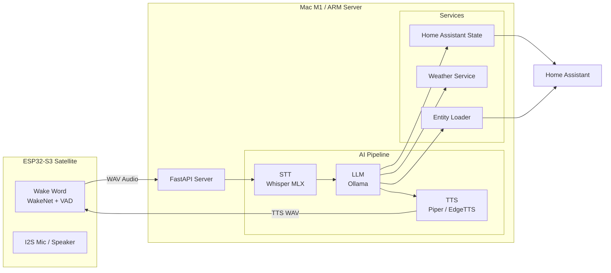

[](https://python.org)
[](https://fastapi.tiangolo.com)
[](https://home-assistant.io)
[](LICENSE)
[](#language)

# 🎙️ HomeCortex — Local Voice AI for Smart Home


> **A fully local, privacy-first voice assistant backend for Home Assistant.**  
> No cloud. No subscriptions. No data leaving your network.


---

## ✨ What is HomeCortex?

HomeCortex is an open-source, self-hosted AI backend for smart homes. It connects ESP32-S3 voice satellites to Home Assistant, processes natural language locally using LLMs, and generates natural voice responses — all without sending a single byte to the cloud.

Kira is the default voice assistant powered by HomeCortex.

Built around Whisper (STT), Ollama (LLM), and Piper or ElevenLabs (TTS), HomeCortex runs on Apple Silicon (Mac M1/M2) and ARM-based edge systems, communicating with distributed ESP32-S3 voice satellites over WiFi.

The platform is designed with a privacy-first and edge-native architecture, enabling low-latency voice interactions, local AI inference, and fully self-hosted automation workflows.

Although primarily designed for French language interactions, the platform also supports English and can be extended to additional languages.

HomeCortex explores the convergence of edge computing, embedded systems, local LLM inference, and real-time voice-driven AI applications for next-generation smart environments.


---

## 🎯 Design Goals

- Privacy-first local AI

- Low-latency voice interaction

- Modular backend architecture

- Edge-compatible satellite devices

- Apple Silicon optimized inference

- Seamless Home Assistant integration

---

## 🏗️ Architecture



---

## ✨ Features

- 🎤 **Low-latency local speech recognition** using Whisper MLX optimized for Apple Silicon
- 🧠 **Fully local LLM inference** powered by Ollama (`qwen2.5:3b` recommended)
- 🔊 **Natural speech synthesis** with Piper (local) or ElevenLabs (cloud)
- 🏠 **Home Assistant integration** for contextual device control and state retrieval
- 🎙️ **Speaker identification** using pyannote.audio for personalized interactions
- 💬 **Web chat interface** built with Go (`kira-web`)
- 📅 **Proactive assistant capabilities** including scheduled reminders and weather briefings
- 🌍 **Multi-language support** with runtime FR/EN configuration

---

## 🧠 Hardware Strategy

HomeCortex follows a two-phase deployment strategy designed to balance rapid development, low-latency inference,and future edge-AI portability.

### Phase 1 — Apple Silicon Development Platform (current)

Apple Silicon systems (Mac Mini / Mac Studio M-series) provide an excellent platform for real-time local AI workloads:

| Capability | Engineering Benefit |
|---|---|
| **Neural Engine (16+ TOPS)** | Accelerated Whisper MLX inference (~0.5s STT) |
| **Unified Memory Architecture** | Simultaneous STT + LLM + backend execution |
| **Metal GPU Acceleration** | Native Ollama acceleration |
| **Low Power Consumption** | Suitable for 24/7 always-on deployment |
| **macOS Stability** | Reliable long-running home server environment |


### Phase 2 — Edge AI Migration (Arduino VENTUNO Q)

The backend architecture is designed to remain hardware-agnostic,
allowing migration from Apple Silicon to embedded AI platforms
without major software refactoring.

```text
 Apple Silicon                          Edge AI Platform
───────────────────            ─────────────────────────────

 STT  : Whisper MLX     ───►   faster-whisper
 LLM  : Ollama          ───►   llama.cpp (GGUF)
 TTS  : Piper / EL      ───►   Coqui XTTS v2

 Runtime abstraction layer
 Environment-based backend selection

 Target:
 Qualcomm Dragonwing IQ8 (40 TOPS NPU)
 Arduino VENTUNO Q
```

This architecture enables experimentation across heterogeneous AI hardware targets while preserving a unified application layer.

---

## 🌍 Language Support

HomeCortex is primarily optimized for French interactions, including
Home Assistant entity aliases, wake phrases, and conversational prompts.

However, the overall architecture remains fully language-agnostic and can be adapted to other languages without modifying the backend logic.

### Supported Components

- **Whisper** provides multilingual speech recognition (99+ languages)
- **Ollama** enables multilingual LLM inference (Qwen2.5, Mistral, Llama 3.x)
- **Home Assistant aliases** can be defined in any language
- **Prompt behavior** is configurable through external prompt templates
- **TTS providers** can be swapped independently of the inference pipeline

### Speech Recognition Vocabulary Injection

To improve speech recognition accuracy in smart-home environments,
Whisper contextual hints (`WHISPER_HINT`) are dynamically generated at startup by aggregating multiple vocabulary sources:

```text
1. Base language vocabulary
   └─ config/lang/<lang>.yaml → whisper_hint_base

2. Home Assistant entity aliases
   └─ HA/core.entity_regsitry  → Home Assistant entity registry

3. Forced phonetic vocabulary
   └─ config/phonetic.yaml → force_vocabulary

This mechanism improves recognition accuracy for:

* Home Assistant entity names
* Custom room and device aliases
* Proper nouns and uncommon words
* Phonetically ambiguous terms
* Multilingual household environments

Adapting to Another Language

Minimal configuration changes are required:

1. Set the target language in:
   └─ config/kira.yaml 

2. Translate the assistant prompt templates
3. Update the base vocabulary and phonetic rules:
   └─ config/lang/<lang>.yaml
   └─ config/phonetic.yaml

4. Select an appropriate TTS voice (Replace ElevenLabs voice ID with your preferred voice)

The runtime architecture remains unchanged, enabling language adaptation entirely through configuration without requiring backend code modifications.

```

## 📂 Project Structure

```text
homecortex/
├── server.py                    # Main FastAPI server
├── prompt.txt                   # Kira personality system prompt
├── prompt_suffix_fr.txt         # French runtime context and rules
├── prompt_suffix_en.txt         # English runtime context and rules
│
├── backends/
│   ├── stt.py                   # Speech-to-Text (Whisper MLX / faster-whisper)
│   ├── llm.py                   # LLM inference (Ollama / llama.cpp)
│   ├── tts.py                   # Text-to-Speech (Piper / ElevenLabs / XTTS)
│   ├── memory.py                # SQLite conversational memory
│   └── speaker.py               # Speaker identification (pyannote.audio)
│
├── services/
│   ├── config_loader.py         # Centralized YAML configuration loader
│   ├── get_ha_state.py          # Home Assistant state retrieval
│   ├── get_weather.py           # Weather service (wttr.in)
│   ├── web_search.py            # DuckDuckGo web search
│   ├── ha_entities_loader.py    # Home Assistant entity alias loader
│   └── proactive.py             # Scheduled announcements (APScheduler)
│
├── config/
│   ├── kira.yaml                # ⚙️ Main configuration
│   ├── room_groups.yaml         # 💡 Room grouping definitions
│   ├── personas.yaml            # 👥 Household users and name variants
│   ├── phonetic.yaml            # 🔤 Whisper phonetic correction rules
│   ├── tools_config.json        # 🛠️ LLM tool configuration
│   ├── satellites.json          # 📡 Satellite tokens and room mapping
│   ├── lang/
│   │   ├── fr.yaml              # 🇫🇷 French keywords and responses
│   │   └── en.yaml              # 🇬🇧 English keywords and responses
│   └── kira_memory.db           # SQLite memory database (auto-generated)
│
├── models/
│   └── piper/                   # Piper TTS models (.onnx)
│
├── HA/
│   └── core.entity_registry     # Home Assistant entity registry cache
│
└── kira-web/                    # Web interface (Go)
    ├── kira-web-main.go
    ├── kira-web.json
    ├── templates/index.html
    ├── static/
    └── locales/
```

---

## 🔄 Request Pipeline

<p align="center">

  

</p>

---

## 🛠️ Installation

### Requirements

- macOS with Apple Silicon (M1/M2/M3/M4) or Linux x86_64
- Python 3.11+ (3.14 not supported for XTTS)
- [Ollama](https://ollama.ai) installed
- Home Assistant instance on local network
- ESP32-S3 satellite with ESP-SR framework

### Quick Start

```bash
# Clone
git clone https://github.com/YOUR_USERNAME/kira-voice.git
cd kira-voice

# Create virtual environment
python3.11 -m venv venv
source venv/bin/activate

# Install dependencies
pip install -r requirements.txt

# Configure
cp .env.example .env
# Edit .env with your HA URL, token, ElevenLabs key, etc.

# Copy HA entity registry (for voice aliases)
mkdir -p HA
cp /path/to/homeassistant/.storage/core.entity_registry HA/

# Download LLM
ollama pull qwen2.5:3b

# Start
python server.py
```

### Environment Variables

```bash
# ── Server ────────────────────────────────────
KIRA_API_TOKEN=your_admin_token
USE_LLM=1

# ── STT (Speech-to-Text) ──────────────────────
STT_BACKEND=mlx_whisper
MODEL_STT=mlx-community/whisper-large-v3-turbo
LANGUAGE=fr

# ── LLM ───────────────────────────────────────
LLM_BACKEND=ollama
LLM_MODEL=qwen2.5:3b
LLM_TEMPERATURE=0.7
LLM_NUM_PREDICT=50

# ── TTS (Text-to-Speech) ──────────────────────
ENABLE_ELEVENLABS=1                         # 1=ElevenLabs, 0=Piper
ELEVENLABS_API_KEY=sk_...
ELEVENLABS_VOICE_ID=your_voice_id
ELEVENLABS_MODEL_ID=eleven_turbo_v2_5       # fast + quality
TTS_CACHE_ENABLED=1

# ── Home Assistant ─────────────────────────────
HA_URL=http://192.168.1.x:8123/api          # with /api for conversation
HA_URL_C=http://192.168.1.x:8123            # without /api for states
HA_TOKEN=your_long_lived_access_token

# ── Memory ─────────────────────────────────────
MEMORY_DB=config/kira_memory.db

# ── Proactive announcements ────────────────────
PROACTIVE_ENABLED=1
PROACTIVE_TZ=Europe/Paris
```

---

## 🔌 API Endpoints

| Method | Path | Auth | Description |
|---|---|---|---|
| `POST` | `/transcribe` | Satellite token | Main pipeline — WAV in, JSON out |
| `POST` | `/tts` | Satellite token | Text → WAV binary (16kHz mono) |
| `POST` | `/alert` | Admin token | Proactive announcement → satellite |
| `GET` | `/debug-auth` | Satellite token | Token diagnostic without audio |
| `GET` | `/memory/stats` | Admin token | Most frequent queries |
| `GET` | `/memory/facts` | Admin token | Memorized facts |
| `DELETE` | `/tts/cache` | Admin token | Clear TTS cache |
| `DELETE` | `/memory/{id}` | Admin token | Clear satellite history |
| `GET` | `/health` | None | Server status + loaded models |

---

## 🧠 Intelligence Layers

### Smart Bypass Routing
```
Query type                  Bypass          Latency
──────────────────────────  ──────────────  ───────
"quelle heure est-il ?"    datetime.now()  ~0ms
"allume [known entity]"     HA direct       ~0ms
"quelle est la météo ?"    Open-Meteo      ~50ms (cached)
"température escalier ?"   HA sensor       ~100ms
Everything else             LLM (Ollama)    ~2000ms
```

### Long-term Memory (SQLite)
- **Facts** — "Souviens-toi que j'aime la lumière tamisée" → stored forever
- **History** — last N exchanges per satellite, survives restarts
- **Query stats** — tracks frequent questions, adapts Kira's behavior
- **Adaptive context** — auto-detects patterns ("Genève = default city")

### HA Alias Integration
Kira reads `core.entity_registry` directly from Home Assistant to load all voice aliases defined in Assist:
```
"chambre 1", "chambre un" → light.group_chambre1
"petit salon"              → switch.lampe_petit_salon
"escalier"                 → switch.lampe_escalier
```
No manual configuration needed — define aliases once in HA, Kira picks them up automatically.

---

## 🗺️ Roadmap

```
✅ Done                          🔄 In Progress        📋 Planned
──────────────────────────────   ─────────────────     ──────────────────────
✅ Multi-satellite auth          🔄 Speaker ID         📋 VENTUNO Q migration
✅ Whisper MLX STT               🔄 Coqui XTTS voice   📋 Vision (LLaVA)
✅ Ollama LLM routing                                  📋 Multi-satellite sync
✅ HA conversation API                                 📋 HA webhook alerts
✅ ElevenLabs + Piper TTS                              📋 Timer/reminder tool
✅ Smart bypass routing
✅ Long-term SQLite memory
✅ HA alias auto-loading
✅ Room-aware entity resolution
✅ Proactive announcements
✅ TTS cache
✅ Weather cache
✅ DuckDuckGo web search
✅ HA state queries
```

---

## 🔧 Hardware

### Current: Apple Mac M1 Pro
- 10-core CPU, 32 GB unified memory
- Whisper runs on Neural Engine (~0.5s per utterance)
- Ollama runs on GPU (qwen2.5:3b ~1.5s)
- Always-on at ~15W

### Satellites: ESP32-S3
- ESP-SR framework (WakeNet + AFE + VADNet)
- 16kHz mono audio capture
- Direct WAV POST to backend over Wi-Fi
- WAV playback via I2S speaker

### Next: Arduino VENTUNO Q
```
Qualcomm Dragonwing IQ8
├── 40 TOPS NPU → Whisper + LLM inference
├── 16 GB LPDDR5 → Qwen2.5-3B + Coqui XTTS
└── Gigabit Ethernet → <10ms network latency

Migration: change 2 lines in .env
STT_BACKEND=faster_whisper
LLM_BACKEND=llama_cpp
```

---

## 📜 License

MIT License — see [LICENSE](LICENSE)

---

## 🙏 Acknowledgments

- [OpenAI Whisper](https://github.com/openai/whisper) — speech recognition
- [ml-explore/mlx-examples](https://github.com/ml-explore/mlx-examples) — Whisper MLX
- [Ollama](https://ollama.ai) — local LLM inference
- [Home Assistant](https://home-assistant.io) — smart home platform
- [ElevenLabs](https://elevenlabs.io) — neural TTS
- [Coqui TTS](https://github.com/coqui-ai/TTS) — open-source TTS + voice cloning
- [Open-Meteo](https://open-meteo.com) — free weather API
- [ESP-SR](https://github.com/espressif/esp-sr) — ESP32 speech recognition
