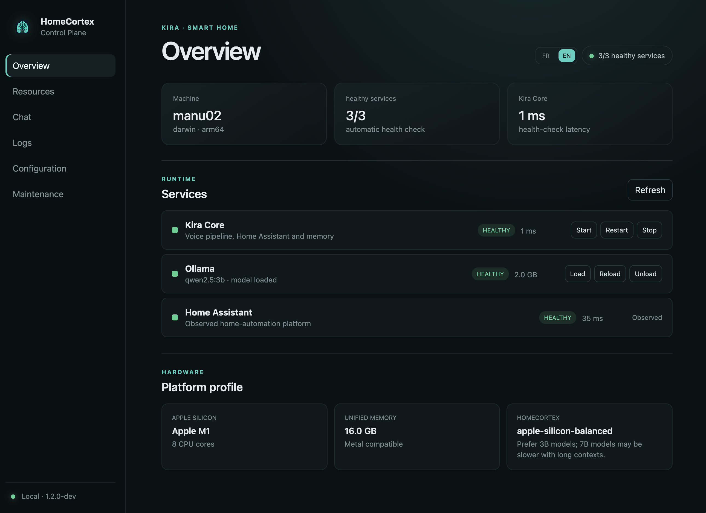
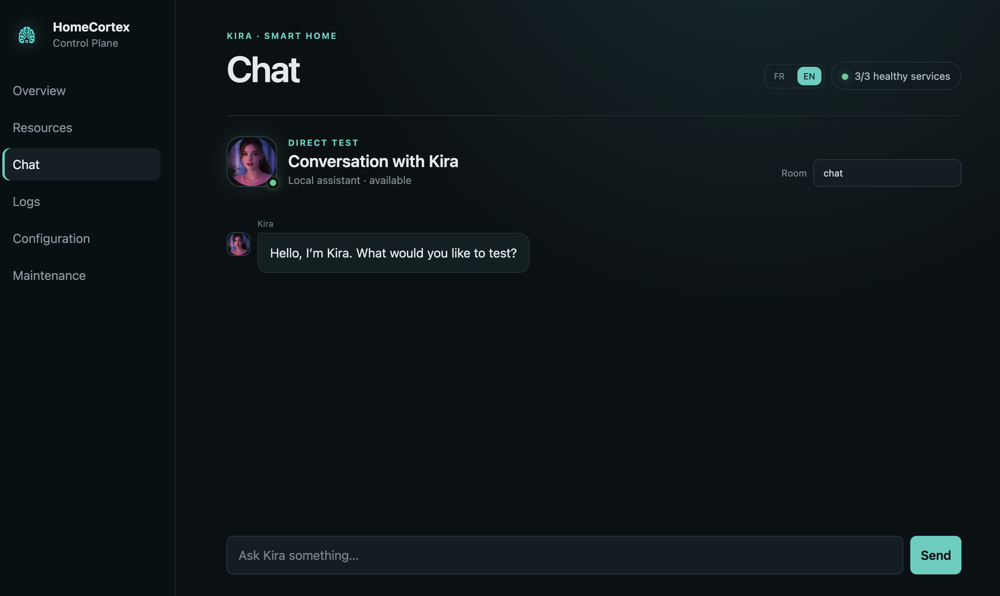

[](https://python.org)
[](https://fastapi.tiangolo.com)
[](https://home-assistant.io)
[](LICENSE)
[](#language)

# 🎙️ HomeCortex — Local Voice AI for Smart Home


> **A fully local, privacy first voice assistant backend for Home Assistant.**  
> No cloud. No subscriptions. No data leaving your network.

> [!NOTE]
> The `ver1.2` branch introduces an automated, configuration-first deployment
> flow and a local Go/React Control Plane. ElevenLabs, weather and web-search
> integrations remain optional network services selected by the operator.

## HomeCortex v1.2 deployment preview

Create a private initialization kit, validate it, then inspect the installation
plan:

```bash
./scripts/create-init.sh
# Edit init/.env, init/config/ and init/prompts/
./install.sh --init-dir ./init --validate-only
./install.sh --init-dir ./init --dry-run
```

Build the local dashboard and Control Plane:

```bash
./scripts/build-control-plane.sh
./control-plane/homecortex-control --root "$PWD"
```

Open `http://127.0.0.1:3210`.

Detailed documentation:

- [Installation and initialization kit](docs/INSTALLATION.md)
- [Control Plane API and dashboard](docs/CONTROL-PLANE.md)


---

## ✨ What is HomeCortex?

HomeCortex is an open-source, self-hosted AI backend for smart homes. It connects ESP32-S3 voice satellites to Home Assistant, processes natural language locally using LLMs, and generates natural voice responses all without sending a single byte to the cloud.

Kira is the default voice assistant powered by HomeCortex.

Built around Whisper (STT), Ollama (LLM), and Piper or ElevenLabs (TTS), HomeCortex runs on Apple Silicon (Mac M1/M2) and ARM-based edge systems, communicating with distributed ESP32-S3 voice satellites over WiFi.

The platform is designed with a privacy-first and edge-native architecture, enabling low-latency voice interactions, local AI inference, and fully self-hosted automation workflows.

Although primarily designed for French language interactions, the platform also supports English and can be extended to additional languages.

HomeCortex explores the convergence of edge computing, embedded systems, local LLM inference, and real-time voice driven AI applications for next generation smart environments.


---

## 🎯 Design Goals

- Privacy-first local AI
- Low-latency voice interaction
- Modular backend architecture
- Edge-compatible satellite devices
- Apple Silicon optimized inference
- Seamless Home Assistant integration

---

## 🏗️ Architecture

<p align="center">

  

</p>


---

## 🧠 Memory Architecture

HomeCortex implements a lightweight persistent memory system built on SQLite (`data/kira_memory.db`).

The architecture combines semantic memory, episodic conversation history, adaptive interaction patterns, speaker profiles, and TTS caching within a unified local database.

All memory layers persist across server restarts while remaining fully local and privacy-preserving.

---

### Semantic Memory — Facts

Semantic memory stores persistent facts about the household, users, devices, and preferences.

Facts can be:

- explicitly provided by users,
- extracted automatically from conversations,
- inferred from repeated interaction patterns.

Examples:

```text
"Emmanuel prefers 19°C at night"
"The guest bedroom light is controlled by the switch near the door"
```

Stored facts are automatically injected into the LLM system prompt under:

```text
WHAT YOU KNOW ABOUT THE HOME
```

This allows HomeCortex to maintain long-term contextual awareness without requiring users to repeat information across sessions.

#### Memory API

```bash
# View stored facts
curl -H "X-Token: YOUR_TOKEN" \
http://localhost:8000/memory/facts

# Delete a fact by ID
curl -X DELETE -H "X-Token: YOUR_TOKEN" \
http://localhost:8000/memory/facts/3
```

---

### Episodic Memory — Conversation History

The last *N* exchanges per satellite are stored in SQLite
(default: `20`, configurable through `config/kira.yaml → memory.max_history`).

During each LLM inference call, recent conversation history is prepended to the messages context window, enabling conversational continuity even after server restarts.

Each satellite maintains an independent conversation history:

```text
Bedroom conversations remain isolated from kitchen interactions.
```

This prevents contextual leakage across rooms and preserves localized conversational context.

---

### Adaptive Context — Learned Habits

HomeCortex continuously tracks recurrent interaction patterns through the `query_stats` table.

Once a pattern exceeds a configurable repetition threshold
(default: `10` occurrences), it is automatically promoted into the runtime system context as a learned habit.

Example:

```text
LEARNED HABITS:
- Favorite weather city: Geneva (47 requests)
- Frequent action: living room light (23 requests)
```

This adaptive layer enables HomeCortex to:

- reduce clarification requests,
- improve intent prediction,
- infer preferred defaults automatically,
- provide more natural long-term interactions.

---

### Unified SQLite Schema

```sql
facts
(
    id,
    content,
    source,
    created,
    updated
)

history
(
    id,
    satellite_id,
    role,
    content,
    created
)

query_stats
(
    id,
    intent,
    canonical,
    count,
    last_seen,
    extra
)

speaker_profiles
(
    id,
    name,
    embedding,
    n_samples,
    created,
    updated
)

tts_cache
(
    hash,
    text,
    wav,
    backend,
    hits,
    created,
    last_hit
)
```

By default, `speaker_profiles` and `tts_cache` share the same SQLite database file.

The storage layout can be separated through:

```text
config/kira.yaml → memory.db
config/kira.yaml → tts.cache_db
```

---

## 🛰️ ESP32-S3 Satellites

HomeCortex communicates with distributed ESP32-S3 voice satellites over WiFi.

The satellite firmware is developed separately in:

- [ESP-myhome-EchoEar](https://github.com/colussim/ESP-myhome-EchoEar)

Current hardware platforms include:

### ESP-VoCat v1.2 (Espressif)

The current reference satellite is based on the official ESP-VoCat v1.2 development board by Espressif.

Features:

- ESP32-S3 dual-core MCU
- Integrated audio codec
- I2S microphone + speaker pipeline
- Wake word detection
- Voice Activity Detection (VAD)
- Low-latency WiFi streaming

This platform is used for rapid prototyping and real-world home deployment.

---

### DIY Satellite Platform (in development)

A fully custom satellite hardware platform is currently under development.

Goals include:

- smaller form factor,
- improved acoustic design,
- optimized microphone array,
- lower idle power consumption,
- easier room integration,
- fully open hardware design.

The long-term objective is to create lightweight edge-native voice nodes optimized for always-on distributed AI interaction.

---

## ✨ Features

- 🎤 **Low-latency local speech recognition** using Whisper MLX optimized for Apple Silicon
- 🧠 **Fully local LLM inference** powered by Ollama (`qwen2.5:3b` recommended)
- 🔊 **Natural speech synthesis** with Piper (local) or ElevenLabs (cloud)
- 🏠 **Home Assistant integration** for contextual device control and state retrieval
- 🎙️ **Speaker identification** using pyannote.audio for personalized interactions
- 💬 **Integrated web dashboard and chat** with a Go Control Plane and React UI
- 📅 **Proactive assistant capabilities** including scheduled reminders and weather briefings
- 🌍 **Multi-language support** with runtime FR/EN configuration

---

## 🧠 Hardware Strategy

HomeCortex follows a two-phase deployment strategy designed to balance rapid development, low-latency inference,and future edge-AI portability.

### Phase 1 — Apple Silicon Development Platform (current)

Apple Silicon systems (Mac Mini / Mac Studio M-series) provide an excellent platform for real-time local AI workloads:

| Capability | Engineering Benefit |
|---|---|
| **Apple GPU / Metal** | Accelerated Whisper inference through MLX |
| **Unified Memory Architecture** | Simultaneous STT + LLM + backend execution |
| **Ollama Metal Acceleration** | Local LLM inference on the Apple GPU |
| **Low Power Consumption** | Suitable for 24/7 always-on deployment |
| **macOS Stability** | Reliable long-running home server environment |


### Phase 2 — Edge AI Migration (Arduino VENTUNO Q)

The backend architecture is designed to remain hardware-agnostic,
allowing migration from Apple Silicon to embedded AI platforms
without major software refactoring.

```text
 Apple Silicon                          Edge AI Platform
───────────────────            ─────────────────────────────

 STT  : Whisper MLX     ───►   faster-whisper
 LLM  : Ollama          ───►   llama.cpp (GGUF)
 TTS  : Piper / EL      ───►   Coqui XTTS v2

 Runtime abstraction layer
 Environment-based backend selection

 Target:
 Qualcomm Dragonwing IQ8 (40 TOPS NPU)
 Arduino VENTUNO Q
```

This architecture enables experimentation across heterogeneous AI hardware targets while preserving a unified application layer.

---

## 🌍 Language Support

HomeCortex is primarily optimized for French interactions, including
Home Assistant entity aliases, wake phrases, and conversational prompts.

However, the overall architecture remains fully language-agnostic and can be adapted to other languages without modifying the backend logic.

### Supported Components

- **Whisper** provides multilingual speech recognition (99+ languages)
- **Ollama** enables multilingual LLM inference (Qwen2.5, Mistral, Llama 3.x)
- **Home Assistant aliases** can be defined in any language
- **Prompt behavior** is configurable through external prompt templates
- **TTS providers** can be swapped independently of the inference pipeline

### Speech Recognition Vocabulary Injection

To improve speech recognition accuracy in smart-home environments,
Whisper contextual hints (`WHISPER_HINT`) are dynamically generated at startup by aggregating multiple vocabulary sources:

```text
1. Base language vocabulary
   └─ config/lang/<lang>.yaml → whisper_hint_base

2. Home Assistant entity aliases
   └─ HA/core.entity_regsitry  → Home Assistant entity registry

3. Forced phonetic vocabulary
   └─ config/phonetic.yaml → force_vocabulary
```

This mechanism improves recognition accuracy for:

* Home Assistant entity names
* Custom room and device aliases
* Proper nouns and uncommon words
* Phonetically ambiguous terms
* Multilingual household environments

Adapting to Another Language

Minimal configuration changes are required:

1. Set the target language in:
   └─ config/kira.yaml 

2. Translate the assistant prompt templates
3. Update the base vocabulary and phonetic rules:
   └─ config/lang/<lang>.yaml
   └─ config/phonetic.yaml

4. Select an appropriate TTS voice (Replace ElevenLabs voice ID with your preferred voice)

The runtime architecture remains unchanged, enabling language adaptation entirely through configuration without requiring backend code modifications.

## 📂 Project Structure

```text
homecortex/
├── server.py                     # Main FastAPI voice and automation server
├── install.sh                    # Configuration-driven installer
├── update.sh                     # Safe updater with mandatory backup
├── pyproject.toml                # Python project and optional feature groups
├── prompt_{fr,en}.txt            # Kira system prompts
├── prompt_suffix_{fr,en}.txt     # Language-specific runtime rules
│
├── backends/                     # STT, LLM, TTS, memory and speaker backends
│   ├── stt.py
│   ├── llm.py
│   ├── tts.py
│   ├── memory.py
│   └── speaker.py
│
├── services/                     # Configuration, Home Assistant and tools
│   ├── config_loader.py
│   ├── get_ha_state.py
│   ├── get_weather.py
│   ├── web_search.py
│   └── ha_entities_loader.py
│
├── config/                       # Repository configuration defaults
│   ├── kira.yaml
│   ├── room_groups.yaml
│   ├── personas.yaml
│   ├── phonetic.yaml
│   ├── tools_config_{fr,en}.json
│   ├── satellites.json
│   └── lang/
│
├── control-plane/                # Go management API
│   ├── main.go
│   ├── management.go
│   ├── backups.go
│   └── web/                      # React dashboard (FR/EN)
│       ├── src/
│       └── public/
│
├── deploy/
│   ├── macos/                    # launchd templates and installer
│   └── linux/                    # systemd templates and installer
│
├── scripts/                      # Build, validation, Ollama and maintenance
├── requirements/                 # Platform-specific dependency locks
├── init.example/                 # Safe template for the private init/ kit
├── docs/                         # Installation and Control Plane guides
├── assets/brand/                 # HomeCortex visual identity
├── models/                       # Optional local voice assets
└── HA/                           # Home Assistant entity registry cache
```


---

## 🔄 Request Pipeline

<p align="center">

  

</p>

---

## 🛠️ Installation

### Requirements

- macOS with Apple Silicon (M1/M2/M3/M4) or Linux ARM64
- Python 3.11+ (3.14 not supported for XTTS)
- [Ollama](https://ollama.com/download) installed (strict external prerequisite)
- Home Assistant instance on local network
- ESP32-S3 satellite with ESP-SR framework

### Quick Start

1. Install and start [Ollama](https://ollama.com/download).
2. Prepare a private `init/` directory from `init.example/`.
3. Select the required model in `init/config/kira.yaml`.
4. Run the HomeCortex installer:

```bash
./install.sh --init-dir ./init
```

HomeCortex does not install Ollama. The installer stops with a clear
prerequisite error when it is absent, then downloads only the configured model
when `ollama.pull_model: true` is set in `init/install.yaml`. Existing models
are never downloaded again.

See [`docs/INSTALLATION.md`](docs/INSTALLATION.md) for the complete automated
installation and update workflow.

To update an existing installation while preserving its runtime configuration:

```bash
git pull
./update.sh --init-dir ./init
```


### Configuration

HomeCortex follows a configuration-driven architecture.

All runtime behavior, language settings, backend selection, satellites,
personas, and automation rules are centralized in: `config/kira.yaml` 

The `.env` file is intentionally limited to secrets and private tokens only.

`.env` — Secrets Only

```bash
# API tokens and private credentials — NEVER COMMIT

KIRA_API_TOKEN="your_admin_token"

HA_TOKEN="your_home_assistant_token"
HA_URL="http://IP_HA:8123/api"
HA_URL_C="http://IP_HA:8123"

ELEVENLABS_API_KEY="sk_..."
# Optional — required only for ElevenLabs TTS

HF_TOKEN="hf_..."
# Optional — required only for pyannote speaker identification
```
---


## 🗣️ Voice models

The `models/` directory holds local TTS assets — no internet connection required at inference time.

### Piper (recommended)

Piper models are compact neural voices (~60 MB each) that run in under 1 second on Apple Silicon or a Raspberry Pi 5. Download the model for your language and place both the `.onnx` and its companion `.onnx.json` config file in `models/piper/`.

```bash
mkdir -p models/piper

# French voice
wget -P models/piper \
  https://huggingface.co/rhasspy/piper-voices/resolve/main/fr/fr_FR/siwis/medium/fr_FR-siwis-medium.onnx
wget -P models/piper \
  https://huggingface.co/rhasspy/piper-voices/resolve/main/fr/fr_FR/siwis/medium/fr_FR-siwis-medium.onnx.json

# English voice (optional)
wget -P models/piper \
  https://huggingface.co/rhasspy/piper-voices/resolve/main/en/en_US/lessac/medium/en_US-lessac-medium.onnx
wget -P models/piper \
  https://huggingface.co/rhasspy/piper-voices/resolve/main/en/en_US/lessac/medium/en_US-lessac-medium.onnx.json
```

Set the active model in `config/kira.yaml`:

```yaml
tts:
  piper_model: fr_FR-siwis-medium
  piper_models_dir: models/piper
```

### XTTS v2 — voice cloning (optional)

XTTS v2 clones a voice from a short audio sample and runs entirely locally. It produces the most natural-sounding output but adds ~1.5s latency compared to Piper.

**Requirements:**

```bash
pip install TTS
```

**Create a speaker sample** — record 20–30 seconds of clean speech in a quiet environment:

```bash
# Record via terminal (requires sox)
rec -r 22050 -c 1 models/xtts/speaker_kira.wav trim 0 25

# Or convert an existing file
ffmpeg -i your_recording.mp4 \
       -ar 22050 -ac 1 -sample_fmt s16 \
       models/xtts/speaker_kira.wav
```

Tips for a good sample: natural speech at a normal pace, no background noise, mix of questions and statements.

**Configure in `.env`:**

```bash
XTTS_SPEAKER_WAV=models/xtts/speaker_kira.wav
```

The XTTS v2 model (~1.8 GB) downloads automatically from Hugging Face on first startup.

### Fallback — espeak

If neither Piper nor XTTS is configured, Kira falls back to `espeak` — a lightweight rule-based synthesizer with no additional dependencies, suitable for testing.

```bash
# macOS
brew install espeak-ng

# Linux / Raspberry Pi
sudo apt install espeak-ng
```

### Comparison

| Backend | Latency | Quality | Size | Requires internet |
|---|---|---|---|---|
| Piper | ~0.8s | ★★★★☆ | ~60 MB/voice | No |
| XTTS v2 | ~1.5s | ★★★★★ | ~1.8 GB | No (download once) |
| ElevenLabs | ~0.4s | ★★★★★ | — | Yes |
| espeak | ~0.1s | ★★☆☆☆ | ~5 MB | No |


---

## 🚀 Running the server

The v1.2 installer registers both Kira Core and the Control Plane with the
native service manager. PM2 is not required:

- macOS Apple Silicon uses per-user `launchd` agents;
- Linux ARM64 uses `systemd` services.

After installation, open the local dashboard:

```text
http://127.0.0.1:3210
```

The dashboard provides health status, start/stop/restart controls, live logs,
resource gauges, configuration and prompt editing, chat, Ollama model control,
and backup/restore.

<p align="center">
  
</p>

### macOS service commands

```bash
launchctl print gui/$(id -u)/io.homecortex.core
launchctl print gui/$(id -u)/io.homecortex.control

launchctl kickstart -k gui/$(id -u)/io.homecortex.core
launchctl kickstart -k gui/$(id -u)/io.homecortex.control
```

Runtime logs are stored in:

```text
~/Library/Application Support/HomeCortex/logs/
```

### Linux service commands

```bash
sudo systemctl status homecortex-core homecortex-control
sudo systemctl restart homecortex-core homecortex-control
sudo journalctl -u homecortex-core -u homecortex-control -f
```

For normal operation, prefer the dashboard controls. The native commands are
useful for diagnostics when the Control Plane itself is unavailable.

---

## 📍 API Endpoints

HomeCortex exposes two local HTTP APIs:

- **Kira Core** on port `8000` for voice, chat and assistant operations;
- **Control Plane** on `127.0.0.1:3210` for local administration.

Kira Core routes marked **Satellite** require an `X-Token` registered in
`config/satellites.json`. Routes marked **Admin** require the private
`KIRA_API_TOKEN`. The health endpoint is intentionally unauthenticated.

### Kira Core — voice and chat

| Method | Endpoint | Access | Description |
|---|---|---|
| `POST` | `/transcribe` | Satellite | Process raw WAV audio through STT, routing, Home Assistant and response generation |
| `POST` | `/tts` | Satellite | Synthesize a UTF-8 text body and return WAV audio |
| `POST` | `/chat` | Satellite, chat or admin | Run the text-only assistant pipeline without STT |

**Example `/transcribe` response:**

```json
{
  "status":       "success",
  "heard":        "quelle est la température extérieure ?",
  "room":         "salon",
  "reply":        "La température extérieure est de 12 degrés.",
  "ha_ack":       "no_action",
  "category":     "SPEECH",
  "expect_reply": false,
  "tts_available": true
}
```

### Kira Core — administration

| Method | Endpoint | Access | Description |
|---|---|---|---|
| `GET` | `/satellites` | Admin | List registered voice satellites |
| `GET` | `/debug-auth` | Diagnostic | Check whether a supplied satellite token is recognized |
| `DELETE` | `/memory/{satellite_id}` | Admin | Clear the active conversation history for one satellite |
| `GET` | `/memory/stats` | Admin | Return learned query statistics |
| `GET` | `/memory/facts` | Admin | List persistent memory facts |
| `DELETE` | `/memory/facts/{fact_id}` | Admin | Delete one persistent fact |
| `DELETE` | `/tts/cache` | Admin | Clear the generated speech cache |
| `POST` | `/alert` | Admin | Generate and push a proactive announcement to a satellite |
| `POST` | `/enroll` | Admin | Register or update a speaker voice profile |
| `GET` | `/speakers` | Admin | List registered speaker profiles |
| `DELETE` | `/speakers/{name}` | Admin | Delete a speaker profile |
| `GET` | `/health` | Public/local | Report loaded backends, satellites and memory counters |

**Example enrollment:**

```bash
curl -X POST http://localhost:8000/enroll \
     -H "X-Token: YOUR_TOKEN" \
     -F "name=Emmanuel" \
     -F "audio=@/tmp/sample_30s.wav"
```

**Example alert:**

```bash
curl -X POST http://localhost:8000/alert \
     -H "X-Token: YOUR_TOKEN" \
     -H "Content-Type: application/json" \
     -d '{"room": "salon", "text": "Dinner is ready."}'
```

**Example `/health` response:**

```json
{
  "status": "ok",
  "satellites": 6,
  "model_stt": "mlx_whisper",
  "model_llm": "ollama",
  "memory_facts": 0,
  "memory_queries": 0,
  "model_tts": "elevenlabs"
}
```

### Control Plane — local administration

The Control Plane refuses non-loopback clients and does not expose `.env`
secrets through its API.

| Method | Endpoint | Description |
|---|---|---|
| `GET` | `/api/v1/system` | Host and Control Plane information |
| `GET` | `/api/v1/services` | Kira, Ollama and Home Assistant health |
| `POST` | `/api/v1/services/{id}/{action}` | Start, stop or restart a managed service |
| `GET` | `/api/v1/events` | Service-state SSE stream |
| `GET` | `/api/v1/logs/stream?service=...` | Masked live-log SSE stream |
| `GET/PUT` | `/api/v1/config` | Read or atomically replace `kira.yaml` |
| `GET/PUT` | `/api/v1/files/{id}` | Manage an allow-listed configuration or prompt file |
| `GET` | `/api/v1/ollama/model` | Configured model and loaded state |
| `POST` | `/api/v1/ollama/model/{action}` | Load, unload or restart the configured model |
| `GET` | `/api/v1/diagnostics` | Platform and acceleration diagnostics |
| `GET` | `/api/v1/resources` | CPU, memory, storage and network metrics |
| `GET/POST` | `/api/v1/backups` | List or create local recovery archives |
| `POST` | `/api/v1/backups/{name}/restore` | Restore a backup and restart Kira |
| `POST` | `/api/v1/chat` | Authenticated proxy to Kira Core chat |

See [`docs/CONTROL-PLANE.md`](docs/CONTROL-PLANE.md) for implementation and
safety details.

---

## 💬 Control Plane Chat

HomeCortex v1.2 integrates its text conversation interface directly into the
local Control Plane dashboard. The former standalone `chatbox/` service is no
longer required.

<p align="center">
  
</p>

### Features

- Real-time conversation interface
- Direct interaction with the HomeCortex backend
- Multi-language support
- Authenticated proxy through the Control Plane
- Responsive web UI
- Session-based conversational context
- Designed for local/self-hosted deployments

### Purpose

The Chatbox interface serves multiple roles within the HomeCortex ecosystem:

* debugging and development,
* silent interaction without voice input,
* backend testing,
* multi-device access,
* fallback interaction mode,
* remote administration.

This separation between voice satellites and textual interaction layers enables a modular multimodal architecture while keeping the backend fully unified.

---

## 🚀 Next Steps & Roadmap

HomeCortex development prioritizes reliable local operation and measured
improvements. Optimization work is accepted only when reproducible benchmarks
show a real end-to-end benefit on supported hardware.

### Phase 1: v1.2 deployment lifecycle

- [x] Configuration-driven installation
- [x] Native `launchd` and `systemd` service management
- [x] Safe updates with automatic pre-update backup
- [x] Dashboard backup and restoration
- [x] Strict Ollama prerequisite and required-model provisioning
- [ ] Safe uninstaller with keep-data and full-removal modes
- [ ] Automated installation and rollback integration tests

---

### Phase 2: Linux ARM64 and Arduino VENTUNO Q validation

- [ ] Validate the production VENTUNO Q Linux image and accelerator APIs
- [ ] Freeze a tested ARM64 Python dependency lock
- [ ] Benchmark STT, LLM and TTS backends on the target hardware
- [ ] Finalize storage, service and hardware-monitoring integration
- [ ] Document migration between macOS and VENTUNO installations

---

### Phase 3: Evidence-based latency optimization

- [ ] Add per-stage STT, routing, LLM, Home Assistant and TTS timings
- [ ] Establish repeatable benchmarks on M1 16 GB and Mac Studio systems
- [ ] Compare model size, context length and Ollama runtime settings
- [ ] Profile safe pipeline concurrency and response caching
- [ ] Keep only optimizations that improve end-to-end latency and stability

Quantization, pruning or alternative runtimes may be evaluated, but they are
not roadmap commitments until measurements demonstrate a useful gain.

---

### Phase 4: Satellite local fallback

- [ ] Design intent classification engine (light, temperature, blinds)
- [ ] Implement a deterministic local fallback for essential commands
- [ ] Create entity mapping configuration
- [ ] Test offline and degraded-network behavior on ESP32-S3 satellites
- [ ] Evaluate TinyML only if it fits the latency, memory and reliability budget

---

### Phase 5: Evaluation and domain adaptation

- [ ] Build an anonymized multilingual smart-home evaluation set
- [ ] Measure command accuracy, tool selection and response quality
- [ ] Improve aliases, prompts and phonetic rules from observed failures
- [ ] Consider fine-tuning only if configuration and prompting plateau


---

## 🚀 Conclusion

HomeCortex is an ongoing exploration of privacy-first conversational AI for smart environments.

The project combines embedded systems, local LLM inference, distributed edge devices, multilingual speech processing, and adaptive memory architectures into a unified self hosted platform designed for real-world usage.

Beyond home automation, HomeCortex serves as an experimental framework for studying:

- low-latency edge AI systems,

- distributed voice interaction,

- contextual conversational memory,

- multimodal human-computer interaction,

- and fully local AI inference pipelines.

The long term goal is to build a modular, hardware-agnostic voice AI ecosystem capable of running entirely on local infrastructure from embedded ESP32-S3 satellites to dedicated edge AI accelerators.

HomeCortex remains actively developed and continuously evolving across both software and hardware layers.

---

## 📚 References

- [OpenAI Whisper](https://github.com/openai/whisper) — speech recognition
- [ml-explore/mlx-examples](https://github.com/ml-explore/mlx-examples) — Whisper MLX
- [Ollama](https://ollama.ai) — local LLM inference
- [Home Assistant](https://home-assistant.io) — smart home platform
- [ElevenLabs](https://elevenlabs.io) — neural TTS
- [Coqui TTS](https://github.com/coqui-ai/TTS) — open-source TTS + voice cloning
- [Open-Meteo](https://open-meteo.com) — free weather API
- [ESP-SR](https://github.com/espressif/esp-sr) — ESP32 speech recognition
